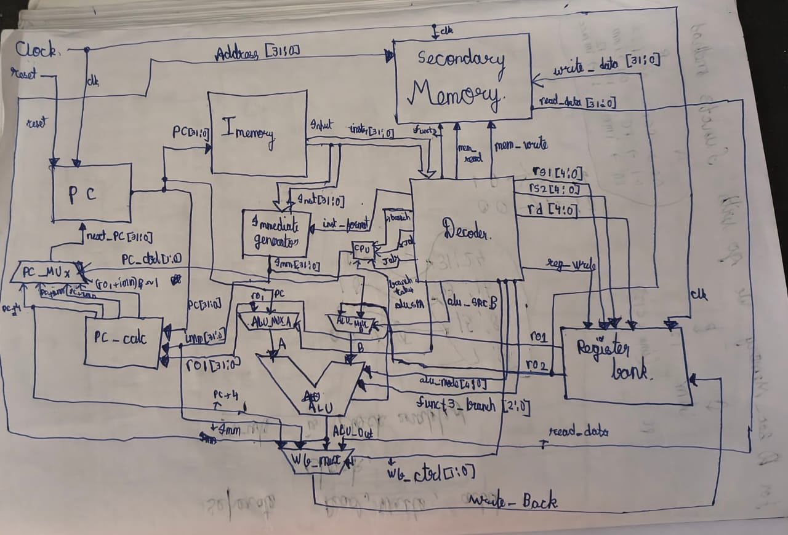

# Single-Cycle RV32I Processor

This project implements a 32-bit single-cycle RISC-V CPU based on the RV32I base integer instruction set. The processor is written in Verilog (HDL) and simulated using Icarus Verilog with GTKWave for waveform visualization.

## Prerequisites

### Required Tools

1. Any text editor of choice
2. Icarus Verilog – for compiling and simulating the Verilog design
3. GTKWave – for viewing simulation waveforms

### Build and Simulation

After installing Icarus Verilog and GTKWave, place all project source files in the same directory. Open a terminal in that directory and run the following commands.

Compile the design, run the simulation, and view the waveform:

```bash
iverilog -g2012 -o sim.out cpu_testbench.v
vvp sim.out
gtkwave wave.vcd
```

The `instruction.b` file contains over 60 preloaded machine-code instructions used for testing.  
To run a custom program, convert the program to machine code and replace the contents of `instruction.b`.

## Architecture

The processor follows a single-cycle architecture where instruction fetch, decode, execute, memory access, and writeback all occur within a single clock cycle.



## ISA Support

This processor implements the complete unprivileged RV32I base integer instruction set.

All six standard instruction formats are supported:
- R-type
- I-type
- S-type
- B-type
- U-type
- J-type

## Design Details


### Main Controller (cpu.v)

This module integrates all datapath components according to the architecture diagram.
It connects the processor modules and generates control signals required for instruction execution, including the signal used to select nextPC.

### PC Calculations  (pc_calculation.v)

This module computes all possible next PC values, such as sequential execution (PC + 4) and branch or jump target addresses. These calculated values are provided as inputs to the PC_mux.

### PC Multiplexer (PC_mux.v)

This module selects the next value of the program counter. Based on control signals from the CPU, it chooses between different possible PC values such as PC + 4, branch targets, or jump addresses.

### Program-Counter (PC.v)

The program counter is a clocked register that holds the address of the current instruction. On each clock edge, the PC is updated with the value of nextPC.

### Instruction Memory (Imem.v)

This module stores program instructions. During simulation, 32-bit machine-code instructions from the `instruction.b` file are loaded into the Imemory array. The program counter (PC) selects the instruction to be executed. Since instructions are word-aligned, the two least significant bits of the PC are ignored.

### Decoder (decoder.v)

The decoder generates all control signals required by the processor and extracts instruction fields.

To determine the instruction type, only the upper five bits of the opcode are examined, since the two least significant bits are always `11` in RV32I instructions.

The decoder first initializes all control signals and then determines the instruction type. Using the opcode, funct3, funct7, and immediate fields, it generates the appropriate control signals required for execution.

### Registers  file (regbank.v)

This module implements the 32 general-purpose registers defined in RV32I.
Each register is 32 bits wide.

- Register writes are synchronous (clocked)

- Register reads are combinational

- Register x0 is hardwired to zero

- Writes to register x0 are ignored

- Register updates occur only when the reg_write signal is asserted

### Secondary Memory (Sec_memory.v)

This module implements the data memory used for load and store operations.

The memory is byte-addressable. Address calculation uses word_offset and byte_offset to determine the exact memory location accessed.

- Reads are combinational

- Writes are sequential (clocked)


### ALU Mux A (alu_mux_A.v)

This multiplexer selects the first operand for the ALU based on control signals generated by the decoder.

### ALU Mux B (alu_mux_B.v)

This multiplexer selects the second operand for the ALU based on control signals generated by the decoder.

### ALU (alu.v)

The ALU performs arithmetic and logical operations on operands A and B.
The specific operation is determined by control signals generated by the decoder using the instruction’s opcode, funct3, and funct7 fields.
The ALU also performs comparison operations used for branch instructions and forwards the result to the CPU.

### Immediate Generator (Immgen.v)

This module generates 32-bit immediate values from the instruction fields.
The decoder provides a signal indicating the instruction format (I, S, B, U, or J type). Based on this format, the immediate generator extracts and reconstructs the immediate value according to the RV32I specification. All immediates are sign-extended to 32 bits so they can be used directly by the ALU.


### Writeback mux (writeback_mux.v)

This multiplexer selects the value that will be written back to the destination register. Possible sources include the ALU result, memory data, or other computed values, depending on the instruction.

## Future Plans

Thanks to the modular design of the RISC-V ISA, this processor can be extended without modifying the existing RV32I base implementation. RISC-V adds functionality through optional instruction set extensions rather than altering previously ratified specifications.

Future work on this project includes extending the processor from RV32I to RV32IMAF, which would add support for:

- M extension – Integer multiplication and division

- A extension – Atomic memory operations

- F extension – Single-precision floating-point arithmetic

These additions would significantly expand the computational capabilities of the processor while preserving compatibility with the existing RV32I implementation.

## References

RISC-V Instruction Set Manual  
https://riscv.org/technical/specifications/

RV32I Reference Card  
https://riscv.org/wp-content/uploads/2017/05/riscv-cheatsheet.pdf

